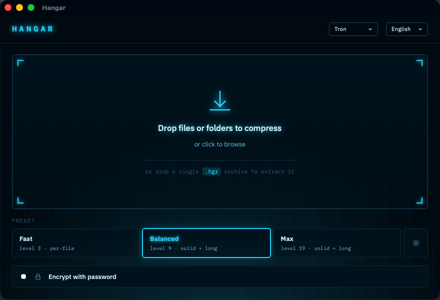

# hangar

A modern archive tool with a desktop app and a CLI. Pick a preset, drop your files, get a `.hgr` archive.



## What's in the box

- **Desktop app** — drag and drop to compress, drop a `.hgr` back in to extract. Three presets (Fast / Balanced / Max) cover almost everyone.
- **CLI** (`hgr`) — same engine, scriptable.
- **7 languages**: Turkish, English, German, French, Russian, Spanish, Arabic (with RTL layout).
- **10 themes**: Hangar (default warm light), Carbon (quiet dark), Matrix (phosphor terminal with falling glyphs), Tron (cyan grid), Synthwave (pink/purple sunset), Dracula, Catppuccin, Monokai, Nord, Terminator (T-800 red on near-black).
- **Optional password encryption** — XChaCha20-Poly1305 AEAD with keys derived via Argon2id. The whole archive (frames + index) is wrapped, so even file names and sizes stay private.

## Benchmark

22 MB mixed corpus, best of three runs:

| Tool  | Settings           |     Output | % of input | Compress | Extract |
| ----- | ------------------ | ---------: | ---------: | -------: | ------: |
| zip   | default            |    7.97 MB |      35.2% |    0.45s |   0.10s |
| zip   | -9                 |    7.95 MB |      35.1% |    0.66s |   0.10s |
| rar   | -m3                |    6.36 MB |      28.1% |    0.17s |   0.04s |
| rar   | -m5                |    6.30 MB |      27.8% |    0.25s |   0.04s |
| 7zz   | -mx=5              |    2.93 MB |      12.9% |    1.85s |   0.07s |
| 7zz   | -mx=9              |    2.90 MB |      12.8% |    2.09s |   0.07s |
| hgr   | -3 (default)       |    7.61 MB |      33.6% |    0.05s |   0.02s |
| hgr   | -9 --solid --long  |    3.26 MB |      14.4% |    0.09s |   0.02s |
| hgr   | -19 --solid --long |    2.85 MB |      12.6% |    2.45s |   0.02s |

`bash bench/run.sh` reproduces this on your machine.

## Build

```bash
cargo build --release
```

Or grab a prebuilt binary for your platform from [Releases](https://github.com/tnsk/hangar/releases).

## CLI

### Basic usage

```bash
hgr c <archive.hgr> <inputs...>     # create
hgr x <archive.hgr> [-o <dir>]      # extract
hgr l <archive.hgr>                 # list contents
hgr t <archive.hgr>                 # verify integrity (hashes every file)
```

Inputs can be any mix of files and directories; whatever you list is walked recursively.

### Three preset recipes

```bash
# Fast — zip-class speed, smaller than zip
hgr c backup.hgr ~/Documents

# Balanced — sweet spot: near-7z ratio, still fast
hgr c backup.hgr -l 9 --solid --long ~/Documents

# Max — beats 7z on max ratio, slow
hgr c backup.hgr -l 19 --solid --long ~/Documents
```

### Flags

| Flag | What it does | Default |
|---|---|---|
| `-l N` | Compression level (1–22). Higher = smaller, slower. | `3` |
| `--solid` | Pack files into shared zstd frames so cross-file duplicates collapse. Trades single-file extract speed for ratio. | off |
| `--long` | Widen zstd's match window to 128 MB. Pair with `--solid` to catch repeats across many files. | off |
| `-T N` | Worker threads. `0` disables MT. | all cores |
| `-e` / `--encrypt` | Wrap the archive in XChaCha20-Poly1305; prompts for a password. | off |
| `--password-from <FILE>` | Read the password from a file (for scripts/CI). | — |
| `--block-size <BYTES>` | Target raw bytes per solid block. Bigger blocks = better ratio, slower single-file extract. | 64 MiB |

### Practical examples

```bash
# Encrypted archive — prompts for the password twice (entry + confirm)
hgr c personal.hgr -e -l 9 --solid --long ~/Documents

# Heavy cross-file redundancy (build artifacts, logs, similar binaries)
hgr c logs.hgr -l 19 --solid --long /var/log

# Single-threaded — friendly on a shared server
hgr c quiet.hgr -T 1 -l 9 ~/work

# Multiple inputs into one archive
hgr c bundle.hgr README.md src/ docs/ .config

# Headless / CI — read password from a file (mind permissions)
echo "$BACKUP_PASSWORD" > /tmp/pw && chmod 600 /tmp/pw
hgr c nightly.hgr -e --password-from /tmp/pw -l 19 --solid --long /var/data
shred -u /tmp/pw

# Extract elsewhere
hgr x backup.hgr -o ~/restored/

# Inspect without extracting
hgr l backup.hgr     # path, size, frame info
hgr t backup.hgr     # streams every file through the codec, verifies xxh3 hashes
```

### Encryption notes

- The whole archive is wrapped — frames **and** the index. File names, sizes, and timestamps stay private.
- `x`, `l`, and `t` auto-detect encryption and prompt for the password.
- A wrong password fails fast with `wrong password, or the archive has been tampered with`. No partial decryption is exposed.

### Recommendation

For most jobs, **`-l 9 --solid --long`** is the right default: small output, still fast to compress, very fast to extract. Drop `--solid` only if you don't have any repeated content (e.g., one large video). Add `-e` whenever the contents shouldn't be readable on disk.

Run `hgr <command> --help` for the full list of flags.
